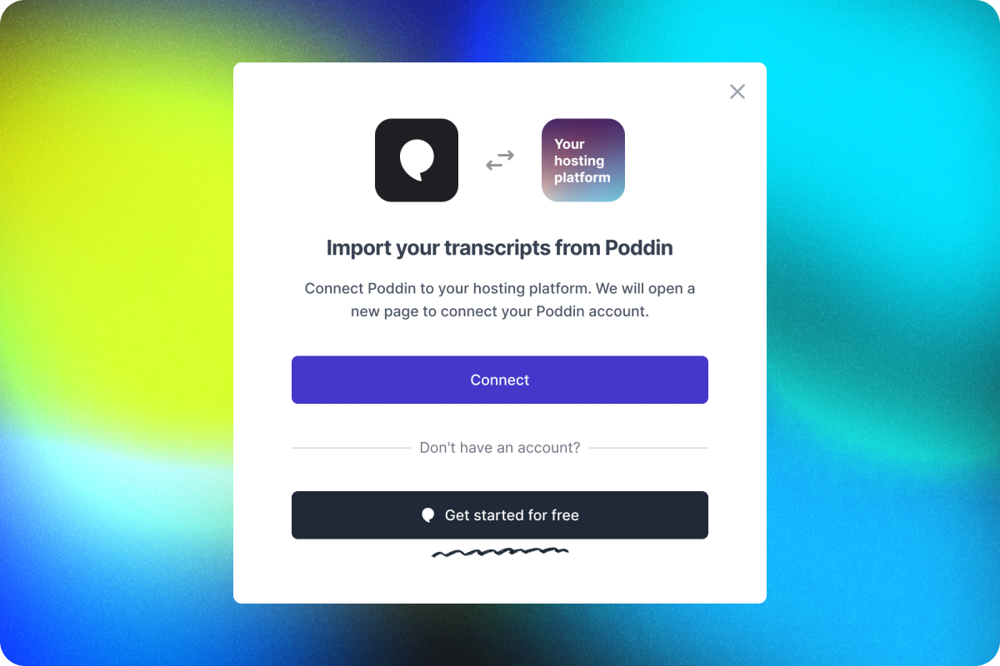

# A very simple demo of Poddin connect using Node.js

1. First, you need to install the Node environment. The Node version >= 16. If you have installed it, skip this step.  install Nodejs:  https://nodejs.org/en/

2. Run `yarn install` or `npm install` to install Node dependencies.

3. After the installation, run `yarn start` or `npm run start` to start the project.

4. Go to `http://localhost:8000` in your browser and you'll see as follow:

if you click the button will bring up the Connect popup

If the user has not authorized before, a page will appear asking for the user's authorization.

then will get the user transcript list pop-up as follow:

or

​If the user does not log in to Poddin, the user's login page will be redirected.​
